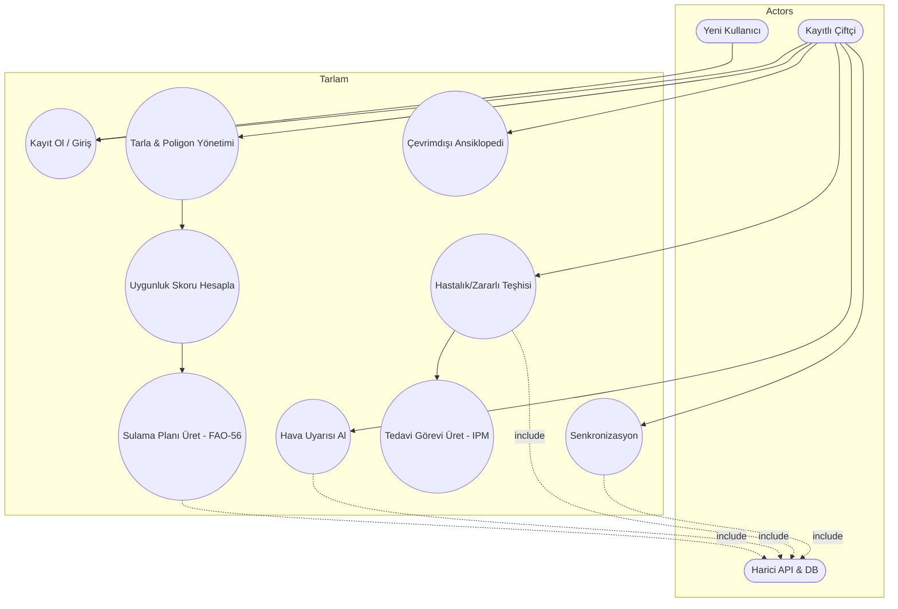
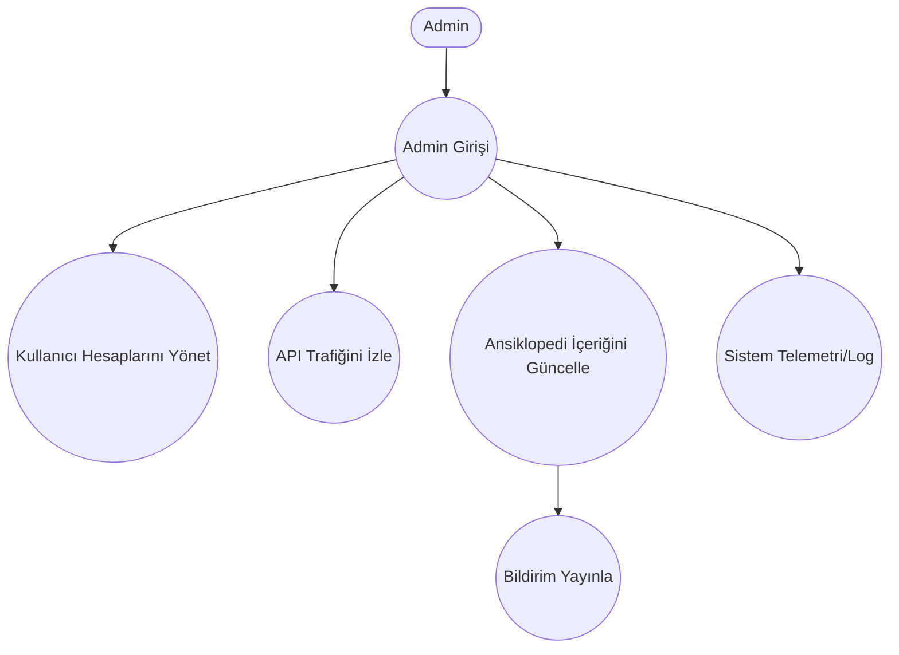
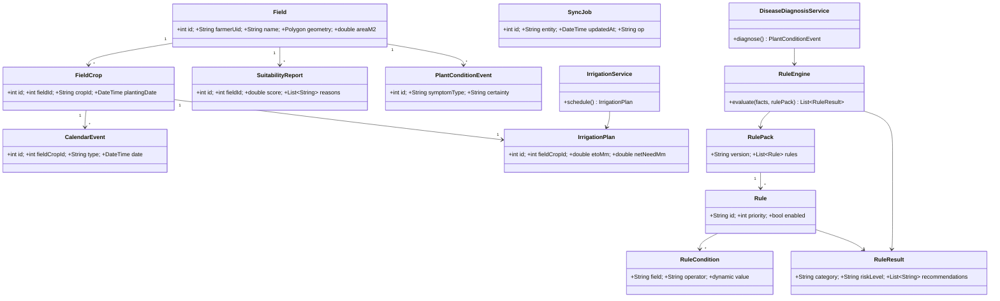
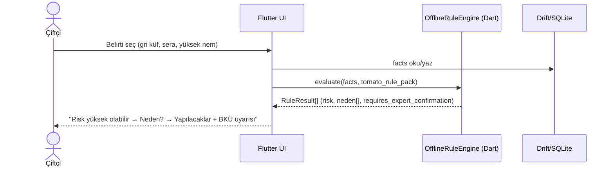
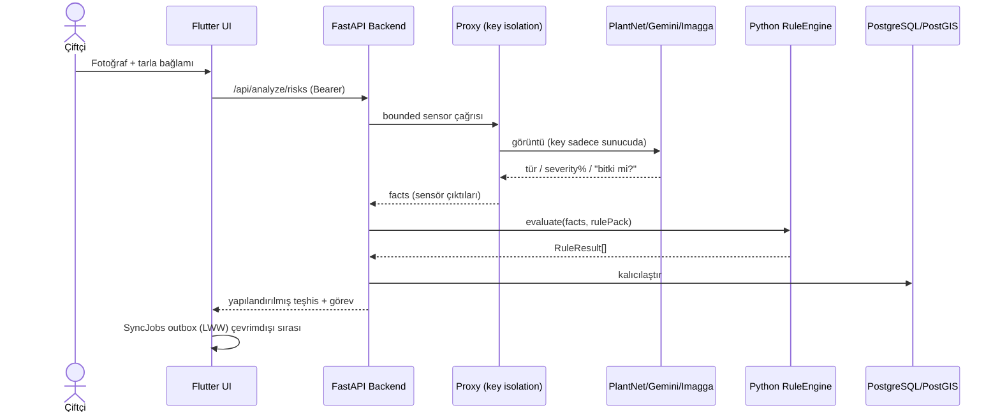
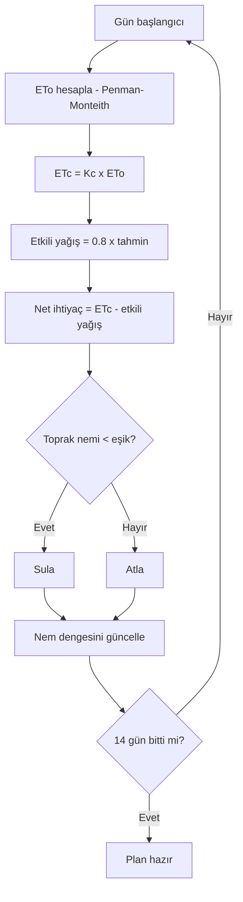

# FENG 498 Final Report — Referans Düzeltmesi + Diyagram Rehberi

> Bu dosya, raporun **teknik gövdesine dokunmadan** iki şeyi düzeltir/tamamlar:
> 1. Sahte/doğrulanamayan akademik referansların yerine **web'de gerçekten var olduğu doğrulanmış** kaynak havuzu.
> 2. Projeye birebir uyan use-case, ER, class ve sequence diyagramlarının nasıl çizileceğinin rehberi (mermaid kaynak koduyla).
> 3. Raporda gözüme çarpan eksik/fazlalıkların düzeltme listesi.

---

## BÖLÜM 1 — Referanslar (KRİTİK)

### 1.1 Neden değişmeli

Mevcut [1], [2], [4], [6] referansları doğrulanamadı — gerçekçi görünen ama büyük olasılıkla
**var olmayan** başlık/dergi/yıl kombinasyonları (LLM hallüsinasyonu). [3] ise "ResearchGate
Preprints" — hakemli ve atıf yapılabilir bir kaynak değil. Bir final raporunda sahte atıf =
intihal/etik soruşturma riski. Üstelik projenizin tüm tezi "hallüsinasyona güvenme"; referans
listesi bu tezle çelişmemeli.

**KORUNAN gerçek kaynaklar:** [5] Hadria (NDVI), [7] FAO-56 Allen et al., [8] TAGEM/BKÜ.

### 1.2 Doğrulanmış yeni referans havuzu

Aşağıdaki kaynakların hepsi gerçek ve web'de erişilebilir. **Her birini DOI/URL üzerinden
bizzat açıp teyit edin**, sonra IEEE formatına geçirin. Raporun her iddiasını hangi kaynağın
desteklediğini eşledim.

| Rapordaki iddia | Önerilen gerçek kaynak | Erişim |
|---|---|---|
| Kırsalda dijital uçurum / düşük bağlantı | Ma, W. & Zhou, X. (2023). *An introduction to rural and agricultural development in the digital age.* Review of Development Economics, 27(3). | doi:10.1111/rode.13025 |
| Çevrimdışı/ICT erişim engelleri | Onitsuka, K. et al. (2018). *Challenges for the next level of digital divide in rural Indonesian communities.* Electronic Journal of Information Systems in Developing Countries. | doi:10.1002/isd2.12021 |
| Kural tabanlı uzman sistem teşhisi | Sriram, N. & Philip, H. *Expert System for Decision Support in Agriculture.* TNAU. | agritech.tnau.ac.in/pdf/14.pdf |
| Bitki hastalığı uzman sistemleri eleştirel inceleme | Mahaman, B. et al. *Expert Systems Applied to Plant Disease Diagnosis: Survey and Critical View.* | ResearchGate 303675433 (yayın künyesini doğrulayın) |
| NDVI uydu / mahsul sağlığı zaman serisi | Hadria, R. et al. (2020). NDVI time series + ML, *Arabian Journal of Geosciences*, 13(16). **[mevcut [5] — koru]** | doi mevcut |
| ML tabanlı mahsul öneri / uygunluk | *Incorporating soil information with machine learning for crop recommendation.* Scientific Reports (Nature), 2025. | doi:10.1038/s41598-025-88676-z |
| Açıklanabilir AI + mahsul önerisi (XAI/güven) | *Advancing crop recommendation system with supervised ML and explainable AI.* Scientific Reports, 2025. | doi:10.1038/s41598-025-07003-8 |
| PlantNet görüntü tanıma sensörü | Goëau, H. et al. *Pl@ntNet mobile app.* / Pl@ntNet Crops, *Environmental Research Letters*. | iopscience 10.1088/1748-9326/acadf3 |
| FAO-56 ETo / Kc | Allen, R.G., Pereira, L.S., Raes, D., Smith, M. (1998). FAO Irrigation & Drainage Paper 56. **[mevcut [7] — koru]** | FAO resmi |
| TAGEM / BKÜ resmi kaynak | T.C. Tarım ve Orman Bakanlığı / TAGEM, Zirai Mücadele Teknik Talimatları; bku.tarim.gov.tr. **[mevcut [8] — koru]** | resmi |

> **Uyarı:** "Survey and Critical View" ve TNAU kaynaklarının tam künyesini (yazar, cilt, yıl)
> indirip teyit etmeden IEEE listesine yazmayın. Diğerlerinin DOI'leri sağlamdır.

### 1.3 Önerilen yeni IEEE referans listesi (taslak)

```
[1] W. Ma and X. Zhou, "An introduction to rural and agricultural development in the
    digital age," Review of Development Economics, vol. 27, no. 3, 2023.
    doi:10.1111/rode.13025

[2] K. Onitsuka, A. R. M. T. Islam, and S. Hoshino, "Challenges for the next level of
    digital divide in rural Indonesian communities," The Electronic Journal of
    Information Systems in Developing Countries, vol. 84, no. 2, 2018.
    doi:10.1002/isd2.12021

[3] N. Sriram and H. Philip, "Expert System for Decision Support in Agriculture,"
    Tamil Nadu Agricultural University. [Online].
    Available: https://agritech.tnau.ac.in/pdf/14.pdf

[4] B. Mahaman et al., "Expert Systems Applied to Plant Disease Diagnosis: Survey and
    Critical View," (künye doğrulanacak).

[5] R. Hadria et al., "Remote monitoring of agricultural systems using NDVI time series
    and machine learning methods," Arabian Journal of Geosciences, vol. 13, no. 16, 2020.

[6] M. S. Reddy et al., "Incorporating soil information with machine learning for crop
    recommendation to improve agricultural output," Scientific Reports, vol. 15, 2025.
    doi:10.1038/s41598-025-88676-z

[7] (XAI) "Advancing crop recommendation system with supervised machine learning and
    explainable artificial intelligence," Scientific Reports, 2025.
    doi:10.1038/s41598-025-07003-8

[8] H. Goëau et al., "Pl@ntNet Crops: merging citizen science observations and structured
    survey data to improve crop recognition," Environmental Research Letters, 2023.
    doi:10.1088/1748-9326/acadf3

[9] R. G. Allen, L. S. Pereira, D. Raes, and M. Smith, "Crop evapotranspiration —
    Guidelines for computing crop water requirements," FAO Irrigation and Drainage
    Paper No. 56, FAO, Rome, 1998.

[10] T.C. Tarım ve Orman Bakanlığı / TAGEM, Zirai Mücadele Teknik Talimatları, and the
     official plant-protection-product database, bku.tarim.gov.tr.
```

### 1.4 Metin içi atıfların güncellenmesi

Rapor gövdesinde atıf numaraları yeni listeye göre kaydırılmalı:
- "Prakash [1]" → dijital uçurum için yeni **[1]** (Ma & Zhou).
- "offline mobile learning systems [2]" → **[2]** (Onitsuka).
- "Hassan et al. [3]" → **[3]/[4]** (TNAU uzman sistemi / Survey).
- "Vaske et al. [4] output reliability" → bu iddia için **[7]** (XAI/güven) daha güçlü dayanak.
- "NDVI [5]" → **[5]** aynı kalır.
- "hybrid CNN+meteo [6]" → **[6]** (Scientific Reports ML crop rec.).

---

## BÖLÜM 2 — Diyagram çizim rehberi

Raporda `[ Paste here: ... ]` yer tutucuları var (use-case ×2, class, ER, sequence ×2,
activity). Hepsini draw.io veya mermaid ile üretebilirsiniz. Aşağıda **projenizin gerçek
kod yapısından** türetilmiş, kopyala-yapıştır mermaid kaynakları var (mermaid.live'da
PNG/SVG'ye çevirin).

### 2.1 Use-Case diyagramı — Kullanıcı



### 2.2 Use-Case diyagramı — Admin



### 2.3 Class diyagramı (kod yapınızdan birebir)



> Not: tablo isimleri/alanları `lib/data/app_database.dart` (schema v11, 11 tablo) ile birebir.
> Alan tiplerini koddan teyit edip diyagrama yazın (uydurmayın).

### 2.4 ER diyagramı (Drift v11 + PostGIS)

```mermaid
erDiagram
  FARMER ||--o{ FIELD : owns
  FIELD ||--o{ FIELD_CROP : has
  FIELD_CROP ||--o{ CALENDAR_EVENT : schedules
  FIELD_CROP ||--o| IRRIGATION_PLAN : produces
  FIELD ||--o{ SUITABILITY_REPORT : evaluated_by
  FIELD ||--o{ PLANT_CONDITION_EVENT : observed_on
  FIELD ||--o{ SYNC_JOB : queues

  FIELD { int id PK; string farmerUid FK; string name; geometry geom_4326; double areaM2 }
  FIELD_CROP { int id PK; int fieldId FK; string cropId; date plantingDate }
  CALENDAR_EVENT { int id PK; int fieldCropId FK; string type; date date }
  IRRIGATION_PLAN { int id PK; int fieldCropId FK; double etoMm; double netNeedMm }
  SUITABILITY_REPORT { int id PK; int fieldId FK; double score; string reasonsJson }
  PLANT_CONDITION_EVENT { int id PK; int fieldId FK; string symptomType; string certainty }
  SYNC_JOB { int id PK; string entity; datetime updatedAt; string op }
```

> Her kullanıcı tablosunda `farmerUid` olduğunu vurgulayın (KVKK izolasyonu — raporun §2.2 ve
> §3.5.2 iddialarını destekler).

### 2.5 Sequence — Çevrimdışı hastalık teşhisi



### 2.6 Sequence — Çevrimiçi çok-API orkestrasyonu



### 2.7 Activity — FAO-56 sulama kararı (Figure 3'ün kaynağı)



---

## BÖLÜM 3 — Eksik / fazlalık düzeltmeleri

### Düzeltilmeli (yazım/tutarlılık)
1. **Sayfa 19, 4. bölüm açılışı:** "What we found is , a complete..." → bozuk cümle.
   Önerilen: *"What we found is that a complete, working offline-first prototype was produced."*
2. **Tutarlılık:** Bazı yerlerde "292-plant", özetin sonunda doğru; rule pack sayısı = **5**
   (corn, orange, sunflower, tea, tomato) — kodla doğrulandı, tutarlı. Koru.
3. **Test sayısı:** "272 test / 50 dosya" — repoda ~51 test dosyası var. Submit'ten hemen
   önce `flutter test` çıktısındaki gerçek sayıyı yazın (sayı değişmiş olabilir).
4. **Figure/Table numaralandırması:** Table 3.1, 3.2, 3.3, 4.1, 4.2 ve Figure 1–3 var;
   metinde "Figure 1 shows..." atıfları doğru. Class/ER/sequence eklenince Figure 4–9
   olarak numaralayıp metne "Figure X" atıfları ekleyin.

### Eksik (eklenmeli)
5. **Use-case, class, ER, sequence diyagramları** hâlâ `[Paste here]` placeholder — Bölüm 2'deki
   mermaid'lerle doldurun. Bunlar olmadan WP1/WP3 teslimatları eksik görünür.
6. **Gantt/zaman çizelgesi** (§3.4.1) placeholder — proposal'daki tabloyu yapıştırın.
7. **Arayüz ekran görüntüleri** (§4.1) placeholder — çalışan uygulamadan capture alın.

### Fazlalık / dikkat
8. **§4.2 "EPDK (water/energy prices)"** harici API listesinde geçiyor ama gövdede başka
   yerde anılmıyor. Gerçekten kullanılıyorsa bir cümle ekleyin; kullanılmıyorsa listeden çıkarın
   (kod tabanında teyit edin).
9. **Vaske et al. "output reliability"** iddiası referans değişince dayanaksız kalmasın —
   yeni [7] (XAI) ile yeniden bağlayın veya cümleyi yumuşatın.

---

## Özet (rapora yansıtılacak net aksiyonlar)

- [ ] Referans listesini Bölüm 1.3 ile değiştir; her DOI'yi bizzat aç-teyit et.
- [ ] Metin içi [1]–[6] atıf numaralarını yeni listeye göre kaydır.
- [ ] Bölüm 2'deki mermaid diyagramlarını üretip placeholder'ları doldur.
- [ ] Sayfa 19'daki bozuk cümleyi düzelt.
- [ ] `flutter test` ile gerçek test sayısını teyit edip yaz.
- [ ] EPDK satırını koddan doğrula; yoksa çıkar.
```
